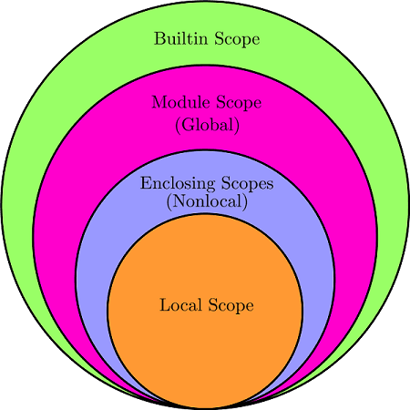
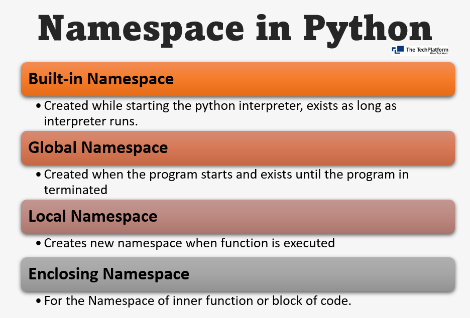

### link

- [link_1](https://github.com/MHBehroozi/pythonlearning)
- [link_2](https://github.com/rezadolati01/pamphlets)

---

---

---

# S00

## S00-E09-py-paradigm

- paradigm : الگو، شیوه و روش برنامه نویسی
- یک زبان میتواند چندین پارادایم را پشتیبانی کند
- paradigm
    1. Imperative دستوری
        - Procedual Programming برنامه نویسی پروسه ای
        - Object Oriented Programing (OOP)برنامه نویسی شی گرا
        - Parallel Processing رایانش موازی
    2. Declarative
        - Logical Programming برنامه نویسی منطقی
        - Functional Programming برنامه نویسی تابعی
        - Database Programming برنامه نویسی پایگاه داده

## S00-E10-py-what-is-python

## S00-E14-py-algorithm-part1.mp4

- algorithm :

1. ورودی
2. خروجی
3. قطعیت
4. محدودیت

# S01

## S01-E01-py-environments

- مفسر و IDLE
- خط فرمان و ترمینال
- notepad
- IDE => integrated development enviroment
- code editor like vscode
- nootebook like jopiter
- web

## S01-E06-py-jupyter

- command : `pip install ipython`
- [jupyter](https://jupyter.org/)
- [anaconda](https://www.anaconda.com/)

## S01-E08-py-web

- searching : python online interpreter

## S01-E10-pycharm-env-part2

- ctrl + f => search
- ctrl + r => search
- ctrl + shift + arrow key => move or select
- alt => select many lines
- ctrl + alt + l => مرتب کردن کد ها
- ctrl + w => انتخاب کد ها به سمت بالا
- ctrl + d => کپی یک خط به سمت پایین
- ctrl + / => comment

## S01-E11-pycharm-env-part3

- ctrl + space => پیشگویی
- alt + Enter => import library of method
- ctrl + alt + o => delete unnecessary library
- view => quick definition || ctrl + shift + i => توضیح متد ها
- view => quick documentation || ctrl + q => داکیومنت
- view => نکات مهم
- code => folding => fold => بسته و باز کردن کد ها
- ctrl + ~ => دسترسی های سریع
- ctrl + shift + a => actions
- select method => ctrl + b => توضیحات
- shift + Enter => رفتن به خط بعد در هرجا از کد
- ctrl + shift + z # ctrl + z
- ctrl + arrow key => جا به جایی بین کلمات و صفحه

# S02

## S02-E01-py-syntax-and-rows

- syntax : how to code
- rows

    1. physical lines => ما میبینیم
    2. logical lines => مفسر میبینه

    - use `;` end the lines
    - #PEP => راهنما برای تمیزی کد

## S02-E02-py-comment-docstring

- comment => # (number sign)
    - کسی که کد های منو توسعه بده
- docstring => ابتدای یک تابع یا کلاس برای توضیح ان تابع یا کلاس
    - کسی که از متد یا تابع من استفاده میکنه

```py
# this is a comment
def my_function():
    """to print hello - this is a docstring"""
    print("hello")
```

## S02-E03-py-indentation

- plugin : indent rainbow

## S02-E04-py-input-output

- input => process => output

- separator

```python
x = 2
y = 4
print("square is :", x * y, sep="-")
```

- end

```python
print("end", end="-")
```

- input

```python
name = input("Enter your name :")
print(name)
```

## S02-E05-py-variable

- variable
    - print variable address

```python
a = 1
print('a = 1 : ', id(a))
a = 2
print('a = 2 : ', id(a))
b = 2
print('b = 2 : ', id(a))

# a = 1 & a = 2 & b =2 have same address
```

- exchange two variable

```python
c, d, e, f = 5, 5, 6, 11
# exchange c & f
c, f = f, c
print('exchange c & f  =>  ', "c : ", c, " &  f : ", f)
```

delete variable

```python
m = 1
del m
```

## S02-E06-identifier

- شناسه
    - variable : `_` or `a-z` or `A-Z`

```python
# variable
a = 8
A = "Ali"
# شناسه خصوصی
_a = 2.3
#  شناسه خصوصی کلاس ها
__a = 1


# class
class MyClass:
    pass


# function
## to print docstring
def print_doc():
    """this is docstring"""
    pass


print(print_doc.__doc__)
```

- class name : is better to write PascalCase
- function name : is better to write small(or camelCase) and use\_ between each word
- variable name : is better to write small
- plugin : string manipulation

## S02-E07-keywords

```python
import keyword

help("keywords")

#
key = keyword.iskeyword("def")
print(key)  # return True or False

#
keyList = keyword.kwlist
print(keyList)

# length of array
print(len(keyList))
```

## S02-E08-arithmetic-operators

- addition : `+`
- subtraction : `-`
- multiplication : `*`
- division : `/`
- modulus : `%`
- exponentiation : `**`
- floor division : `//`

```python
x = 5
y = 4
z = x + y
print("+", z)

z = x - y
print("-", z)

z = x * y
print("*", z)

z = x / y
print("/", z)

z = x % y
print("%", z)

z = x ** y
print("**", z)

z = x // y
print("//", z)
```

## S02-E09-comparison-operators

- equal : `==`
- not equal : `!=`
- greater than : `>`
- less than : `<`
- greater than or equal to : `>=`
- less than or equal to : `<=`
- return True Or False

## S02-E10-assignment-operators

- `=` : `x = 5`
- `+=` : `x += 5` : `x = x + 5`
- `-=` : `x -= 3` : `x = x - 3`
- `*=` : `x *= 3` : `x = x * 3`
- `/=` : `x /= 3` : `x = x / 3`
- `%=` : `x %= 3` : `x = x % 3`
- `//=` : `x //= 3` : `x = x // 3`
- `**=` : `x **= 3` : `x = x ** 3`
- binary operator :
- `&=` : `x &= 3` : `x = x & 3`
- `|=` : `x |= 3` : `x = x | 3`
- `^=` : `x ^= 3` : `x = x ^ 3`
- `>>=` : `x >>= 3` : `x = x >> 3`
- `<<=` : `x <<= 3` : `x = x << 3`

> CODE IN PYTHON FILE

## S02-E11-logical-operators

- and : returns true if both statements are true
- or :  returns false if both statements are false
- not : reverse thr result

```python
x = 5
y = 3
print(x < 4 or y < 4)  # return True
print(x < 4 and y < 4)  # return False
print(not (x < 6))  # returns False
print(not False)
```

## S02-E12-membership-operators

- in
- not in

```python
# x in y => y میتواند رشته باشد یا ارایه باشد 
s = "Melika karimi"
print("m" in s)  # returns True
print("m" not in s)  # returns False
my_list = [1, 2, 3, 4]
print(5 in my_list)  # returns False
```

## S02-E13-identity-operators

- identity-operators => عملگر های هویت
- is : returns true if both variable are the same object
    - باید خانه حافظه یکسان داشته باشند
- is not : returns true if both variable are not the same object

```python
x = 5
y = 5
z = 4
print(x is y)  # returns True
print(x is not z)  # returns True

# list 
a = [1, 2, 3]
b = [1, 2, 3]
print("a==b ? : ", a == b)  # returns True 
print("a is b : ", a is b)  # returns False
print("id(a) : ", id(a))
print("id(b) : ", id(b))

# 
c = a
print("id(c) : ", id(c))
print("a==c ? : ", a == c)  # returns True
print("a is c ? : ", a is c)  # returns True

```

## S02-E14-bitwise-operators

- `&` : And => set each bit to 1 if both bits are 1
- `|` : Or => set each bit to 1 if one of two bits is 1
- `^` : Xor => set each bit to 1 if only one of two bits is 1
- `~` : Not => invert all the bits
- `<<` : Zero fill left shift
- `>>` : signed right shift

```python
x = 0b10101
print(x)
```

> CODE IN PYTHON FILE

## S02-E15-walrus

```python
x = 2
# print(x=3)  # it does not work
print(x := 3)  # it does work
```

## S02-E16-operator-precedence

## S02-E17-expressions-and-statements

- expressions : تولید یک مقدار و قابل ارزیابی
- statement : دستوری : انجام یک دستور
    - دستورات ساده : x = 7
    - دستورات مرکب یک بخشی: مثل توابع
    - دستورات مرکب چند بخشی : مثل شرط ها
    - میتوانند چیزی را هم تولید نکنند
    - از عبارت ها تولید میشود

## S02-E18-class-method-attribute

- object oriented programming => OOP

## S02-E19-pep8-pep20

- [peps](http://python.org/dev/peps)

- [pep20](https://peps.python.org/pep-0020/)
    - [pep20_by_example.py](https://gist.github.com/evandrix/2030615)

```python
import this  # ctrl + b
```

- [pep8](https://peps.python.org/pep-0008/)
    - [pep8_persin](https://pep8.ir/)

# S03

## S03-E01-data-types

python data type :

- numeric
    - integer
    - float
    - complex
- dictionary
- boolean
- set
- sequence type
    - string
    - list
    - tuple
- special

## S03-E02-numbers

- integer
- float
- complex

- casting => تبدیل واحد بزرگ تر به کوچک تر

> CODE IN PYTHON FILE

## S03-E03-example-for-numbers

> CODE IN PYTHON FILE

## S03-E04-exercises-season3-numbers

> CODE IN PYTHON FILE

## S03-E05-string-part1

- strings in Python are arrays of bytes representing unicode characters.
- You can assign a multiline string to a variable by using three quotes Or three single quotes
- `isinstance(variable, datatype)` => نمونه ای از یک دیتا تایپ خاصی هست یا خیر
- `type(variable)`
- `\n` => رفتن به خط بعدی
- `\` or r => لغو کاری
- `*` or duplicate => تکرار
- `+` or contact => چسباندن بهم

## S03-E06-string-part2

- index
- slice
- len => سایز رشته
- Looping Through a String :

```python
for x in "banana":
    print(x)
```

## S03-E07-string-methods

- [string methods](https://www.w3schools.com/python/python_ref_string.asp)
- function : `fync_name(string_varible)` => like :`len()`
- method : `string_variable.method_name()` => like :`upper()`

1. `len()` : سایز رشته
2. `.upper()` => تبدیل حروف رشته به حروف بزرگ (returns the string in upper case)
3. `.lower()` => تبدیل حروف رشته به حرف کوچک (returns the string in lower case)
    - `casefold()` => This method is similar to the `lower()` method, but the `casefold()` method is
      stronger, more
      aggressive, meaning that it will convert more characters into lower case, and will find more
      matches when
      comparing two strings and both are converted using the `casefold()` method.
4. `.count()` => شمارش یک یا چند حرف خاص در یک رشته
5. `.endswith()` => ایا رشته من با کاراکتر خاصی پایان یافته است یا نه(Returns true if the string
   ends with the specified
   value)
6. `.startswith()` => (Returns true if the string starts with the specified value)
7. `.find()` => پیدا کردن یک کاراکتر خاص در رشته از سمت چپ
8. `.rfind()` => پیدا کردن یک کاراکتر خاص در رشته از سمت راست
9. `.isalnum()` => ایا تمام این کاراکتر ها از حرف و عدد هستند یا خیر
10. `.isnumeric()` => فقط و فقط از ارقام است یا نه (    Returns True if all characters in the string
    are numeric)
11. `.join()` => چسباندن یک لیست شامل (Joins the elements of an iterable to the end of the string)
12. `.split()` => جدا کردن رشته ها برحسب یک کارکتر خاص و قرار داند آنها در یک لیست (returns a list
    where the text
    between the specified separator becomes the list items)
13. `.replace("old","new")` => جایگذاری کارکتری با یک کاراکتر دیگر (replaces a string with another
    string)
14. `.strip()` => حذف تعدادی کاراکتر از اول یا اخر رشته (removes any whitespace from the beginning
    or the end)
15. `.rstrip()` => حذف تعدادی کاراکتر از سمت راست رشته
16. `.lstrip()` => حذف تعدادی کاراکتر از سمت چپ رشته
17. `.capitalize()` => اولین کاکراکتر را حتبدیل به حرف بزرگ میکند
18. `in` => To check if a certain phrase or character is present in a string
19. `not in` => To check if a certain phrase or character is NOT present in a string

> CODE IN PYTHON FILE

## S03-E08-unicode-escape-characters

- start with `\`
- [ascii](https://www.asciitable.com/)
- [unicode](https://www.utf8-chartable.de/)

- [strings_escape](https://www.w3schools.com/python/python_strings_escape.asp)
- `ord()` => پیدا کردن یونیکد یک رشته یا حرف یا کاراکتر
- `char()` => پیدا کردن حروف یا کاراکتر یک یونیکد
- `\b` => حذف کردن یک کاراکتر قبلی
- `\r` => کاراکتر های بعدی را وارد خط اول میکند
- `\t` => فاصله یک تب

## S03-E09-traditional-string-format

- [string_formatting](https://www.w3schools.com/python/python_string_formatting.asp)

- `"%[(key)][flag][w][.p] type" %(مقدار یا متغیر )`

> CODE IN PYTHON FILE

## S03-E10-string-format-with-format

- [pythons document](https://docs.python.org/3/library/string.html)
- `.format()`

    - `"{" [field_name] ["!"conversion] [":"format_spec] "}"`

        - `:[[fill]align][sign][#][0][width][grouping-option][.precision][type]`

> CODE IN PYTHON FILE

## S03-E11-f-string

- f string => python 3.6
- module : `import datetime`
    - [datetime in python documents](https://docs.python.org/3/library/datetime.html)

> CODE IN PYTHON FILE

## S03-E12-example-for-string

## S03-E13-exercises-season3-strings

- `.isdecimal()` = `.isdigit()` = `.isnumeric()`

## S03-E14-list-part1 && S03-E15-list-part2 && S03-E16-list-part3

- [list](https://www.w3schools.com/python/python_lists.asp)
- List :
    - Lists are used to store multiple items in a single variable.
    - Lists are one of 4 built-in data types in Python used to store collections of data, the other
      3 are Tuple, Set,
      and Dictionary, all with different qualities and usage.
- List Items :
    - List items are:
        1. ordered : the items have a defined order, and that order will not change.
        2. changeable/mutable : we can change, add, and remove items in a list after it has been
           created. # immutable like str
        3. allow duplicate values : lists can have items with the same value.
- List items can be of any data type

---

- how to make a list :
    - `[]`
    - `list()` => لیست کردن یک عبارت
    - `.split()`

---

- copy in python :
    - shallow copy => ارجاع مشترک
        - module : `list-name.copy.copy()`
    - deap copy => ارجاع مشترک ندارد
        - module : `deapcopy.copy()`

---

- these are also use in Array :
    - `in`
    - `on in`
    - `==`

<details>
<summary>Add List Items</summary>
<ul>
<li><code>insert()</code> => inserts an item at the specified index</li>
<li><code>list_name.append(new_item)</code> => append an item</li>
<li><code>first_list.extend(second_list)</code> => To append elements from another list to the current list</li>
</ul>
</details>
<br>
<details>
<summary>Remove List Items</summary>
<ul>
<li><code>del list_name(list_item)</code> => removes the specified index<ul><li>The del keyword can also delete the list completely.</li></li> </ul>
</li>
<li><code>list_name.remove(list_item)</code> => removes the specified item</li>
<li><code>list_name.pop(item_index)</code> => removes the specified index
<ul><li>If you do not specify the index, the pop() method removes the last item.</li></ul>
</li>
<li><code>list_name.clear()</code> => empties the list</li>
</ul>
</details>

## S03-E17-tuple

- like list but tuple are immutable(we cant change them)
- how to write :
    - ()
    - معمولا دارای نوع های متفاوت دارند

```python
t = (1, 2)
print(id(t))  # 1
t += (5,)
print(id(t))  # 2
print(t)
# 1 & 2 have different id 
```

## S03-E18-dict-part1 && S03-E19-dict-part2

- how to write dict :
    - `{"key" : value}`
        - key => هر نوع داده ای که غیر قابل تغییر باشد مثل عدد و استرینگ و تاپل ولی نمیتواند
          لیستی باشد
            - دیکشنری ها خود نمیتوانند به جای کلید باشند
        - value => هرچیزی میتواند باشد
    - نباید کلید های یکسان داشته باشیم
    - ترتیب مهم نیس

---

- methods :
    - جمع و تفریق ساپورت نمیشود
    - `dic_name.get(key_name)`
    - `dic_name.keys()`
    - `dic_name.values()`
    - `dic_name.items()`
    - `len(dic_name)`
    - `in`
    - `is`
    - how to delete :
        - `del dic_name[key_name]`
    - `sorted(varable_name)`
    - تبدیل به دیکشنری
        - باید داده ما کلید مقدار باشد
        - `dict([(key,value),(key,valu)])`
    - `zip(list_name_1 , list_name_2)`
    - `list(zip(...))` => for show

---

- dictionary name :
    - mapping
    - نگاشت

 ---

- copy in python :
    - shallow copy => ارجاع مشترک
        - module : `dic-name.copy.copy()`
    - deap copy => ارجاع مشترک ندارد
        - module : `dic_name.copy.deepcopy()`

## S03-E20-set-part1 && S03-E20-set-part1

- set : یک سرس اشیا که دارای ویژگی های مشترک هستند
- مثل همان مجموعه ها در ریاضی
- قابل تغییر هستند
- عناصر تکراری قبول نمیکنند
- ترتیب خاصی ندارند
- ممکن ترتیب در نشان دادن ها متفاوت شود
- نمیتوانیم از ست ها در کلید دیکشنری ها استفاده کنیم چون قابل تغییر هستند ولی کلید دیکشنری نباید
  تغییر کند
- درون مجموعه نمیتوان مقدار قابل تغییر استفاده کنیم مثل ارایه

---

- methods:
    - `set_name.add(item)`
    - `set_name.update([item1,item2,..])`
    - `set()` => empty set
    - `set_name.remove(item)`
        - زمانی که ایتم مورد نظر وجود نداشته باشد خطا میدهد
    - `set_name.discard(item)`
        - اگر ایتم مورد نظر وجود نداشته باشد خطا نمیدهد
    - `len(set_name)`
    - `set_name1.difference(set_name2)` == `set_name1 - set_name2`
    - `set_name1.union(set_name2)` == `set_name1 | set_name2`
    - `set_name1.intersection(set_name2)` == `set_name1 & set_name2`
    - `set_name1.symmetric_difference(set_name2)` == `set_name1 ^ set_name2`
    - `set_name1.issuperset(set_name2)` == `set_name1 > set_name2`
    - `set_name1.issubset(set_name2)` == `set_name1 < set_name2`

## S03-E24-None-bool

## S03-E25-and-or-with-datatypes

# S04

## S04-E01-Multiple-inputs-in-a-line

> CODE IN PYTHON FILE

## S04-E02-E03-decision

- فقط یدونه else میتوانیم استفاده کنیم
- میتوان چند مورد elif را نوشت
- elif باید بعد از if باشد

```python
condition = "?"
if condition:
    print("success code")
elif condition:
    print("elif code")
else:
    print("fail code")
```

- اگر شرط در خط اول درست بود خط های بعدی را چک نمیکند

## S04-E05-python-sum-min-max

- `min([num1 ,num2 , ..], defualt = default_number)`
- `max([num1 ,num2 , ..], defualt = default_number)`
- `sum([num1 ,num2 , ..], start =0)`

# S05

## S05-E01-while

```python
condition = 0
while condition:
    print("while code")
```

## S05-E03-break-continue-else

- break => از حلثه خارج میشود

```python
condition = 0
condition_2 = "sth"
while condition:
    print("while code")
    if condition_2:
        break
```

- continue

```python
condition = 0
condition_2 = "sth"
while condition:
    print("while code")
    if condition_2:
        continue
```

- else : بریک و خطایی اتفاق نیوفته و حلقه به صورت نرمال اتمام شود

```python
condition = 0
condition_2 = "sth"
while condition:
    print("while code")
    if condition_2:
        continue
else:
    print("Ok")
```

## S05-E04-nested-loop

```python
condition = 0
condition_2 = 0
while condition:
    print("while 1 code")
    while condition_2:
        print("while 2 code")

```

## S05-E05-for-loop

- برای توالیا خیلی بهتر است

```python
obj = [1, 2, 3]
for target in obj:
    print(target)
```

- also break and continue and else use in for loop

```python
obj_1 = [1, 2, 3]
obj_2 = [4, 5, 6]
for target_1 in obj_1:
    for target_2 in obj_2:
        print(target_2)
    print(target_1)
```

## S05-E06-range

- مشخص کردن یک بازه
- مشخص کردن گام

```python
type(range(10))  # range
range(10)  # از صفر تا ده برو
```

## S05-E07-for-tips

- `enumerate([1,2,3])`
- `zip(list_1 , list_2)`
- `reversed(list)`
- `sorted()`

## S05-E08-random

```python
from random import random, seed, uniform, randint, randrange, choice, sample, shuffle
# use methods
```

- `random()` => بازه صفر و یک
- `randint(min ,max)` =>
- `seed(number)` =>عدد تصادفی ب حسب عدد وارد شده
- `(min + (random()*(max -min)))`
- `uniform(min ,max)`
- `randrange(min , max , phy)`
- `choice(list_name)`
- `sample(list_name , count)`
- `shuffle(list_name)` => change the list
- `variable.copy()`
- numpy = random => for machine learning

## S05-E11-miniproject-password-generator

```python
import string

lower = string.ascii_lowercase
upper = string.ascii_uppercase
lower_upper = string.ascii_letters
print(lower)
print(upper)
print(lower_upper)
```

## S05-E12-miniproject-timer

```python
import time
from os import system, name

# در پایچارم کار نمیکند 
if name == "nt":
    system("cls")
else:
    system("clear")
time.sleep(1)  # وقفه انداختن در یک کد 
```

# S06

## S06-E01-function

- how to write function :

```python
def function_name(x):
    return 2 * x + 1


function_name(3)
```

## S06-E02-function-syntax

- function name : small case and camelCase
- `return None`

```python
def funct():
    x = input("user input : ")
    print(int(x) ** 3)
    # return None #  default


print(funct())  # print None
```

- بعد از ریترن کدی اجرا نمیشود

```python
def why():
    x = input("user input : ")
    return int(x) + 3
    print("hi")  # اجرا نمیشود


print(why())
```

- pass :

```python
def function():
    pass
```

- rename function name :

```python
def cube(x):
    return x ** 3


n = cube
print(n)
print(cube)
print(n(3))

```

- good coding book

## S06-E04-argument-syntax

- one parameter == one arguments

1. normal
2. name = value
3. normal + (name =value)
4. *iterable => str , tuple , list , set , ...
5. **dict

```python
## a ,b, c => parameters
def maxing(a, b, c):
    return max(a, b, c, )


# 1,2,3 => arguments
# normal
print(maxing(1, 2, 3))
# name = value
print(maxing(b=4, c=2, a=3))
# normal + (name =value)
print(maxing(4, c=2, b=3))
# *iterable
print(maxing(*[1, 4, 7]))
x = {10, 9, 7}
print(maxing(*x))
# **dict
d = {"b": 4, "c": 11, "a": 56}
print(maxing(**d))
```

## S06-E05-parameter-syntax

1. normal
2. default value
3. normal + default value
4. *name
5. **dict

```python
# normal
def func(a, b, c, d):
    print("a : ", a)
    print("b : ", b)
    print("c : ", c)
    print("d : ", d)


func(3, 6, 9, 1)


# default value
def func(a=3, b=6, c=8, d=9):
    print("a : ", a)
    print("b : ", b)
    print("c : ", c)
    print("d : ", d)


func()

```

## S06-E06-py-parameter

- `*`
- `/`

## S06-E07-docstring

- [docstring](https://pandas.pydata.org/docs/development/contributing_docstring.html)
- docstring => نوشتن عملکرد تابع
    1. اولین خط بعد از تعریف تابع
    2. توصیف کوتاه
    3. اختیاری است
    4. `func_name.--doc--` => نشان دادن docstring
    5. `help(func_name)` => نشان دادن docstring

```python
def maxing(a, b, c):
    """"Max three numbers."""
    return max(a, b, c)


print(maxing(1, 2, 3))
print(maxing.__doc__)
print(help(maxing))
#######
print(max.__doc__)
```

## S06-E08-function-annotations

- [annotation](https://www.javatpoint.com/function-annotations-in-python#:~:text=Function%20annotations%20are%20some%20random,party%20or%20external%20python%20libraries.)
- mypy package
- `function_name.__annotations__`

## S06-E09-first-class-function

1. Can be created at runtime
2. Can be assigned to a variable
3. Can be passed as argument to a function
4. Can be return as result from a function
5. Can have properties and methods

> CODE IN PYTHON FILE

- `functioName.__name`

## S06-E10-E11-namespace-scope-part1-part2




```python
# built-in
import math

pi = 30
print(math.pi)
print(dir(math))
print(dir(__builtins__))
x = 6

globals()["y"] = 2


def func():
    pass;


# global
print(globals())
print(locals())


def func_1():
    a = 2
    b = 4
    print(a, b)
    print(locals())

    def func_11():
        a = 45
        b = 65
        print(locals())

    func_11()


def func_2():
    a = 3
    b = 6
    print(a, b)
    print(locals())


func_1()
func_2()
```

## S06-E12-pass-by-value-vs-pass-by-reference

- mutable => تغییر شی به شرط که ایدی شی تغییر نکند
    - list
    - dic
    - set
- immutable => pass by value
    - boolean
    - number
    - string
    - tuple

## S06-E13-exercises-season6-function

1. تابعی بنویسید که کار تابع داخلی len را انجام دهد.
2. تابعی بنویسید که کار تابع داخلی max یا min را انجام دهد
3. تابعی بنویسید که کار تابع داخلی sum را انجام دهد
4. تابعی بنویسید که یک عدد به عنوان ورودی گرفته تشخیص دهد عدد مربع است یا خیر
5. تابعی بنویسید که قیمت کالا و درصد تخفیف را گرفته و قیمت پس از تخفیف را محاسبه کند.
6. تابعی بنویسید که یک کاراکتر را خوانده و مشخص کند کاراکتر یک رقم، حرف بزرگ، حرف کوچک و یا سایر
   نماد ها است

## S06-E14-lambda

- به صورت خودکار return دارد و ما نمینوسیسم
- چند ورودی دارد اما بدنه ان یکی عبارت است
- در بدنه while و for و ... نوشته نمیشود
- built-in functions :
    1. `map(function_name,list)`
    2. `filter(function_name,list )`
    3. `reduce(function_name,list)`
        - `from functools import reduce`
    4. `sorted(list , key=function_name )`

```python

x = lambda parameters1, parameters2: parameters1 ** parameters2
print(x(2, 3))
```

## S06-E15-exercises-season6-lambda

1. برنامه ای بنویسید که با استفاده از لامبدا، اعداد زوج و فرد را در یک لیست از اعداد صحیح بشمارد
2. لیست ی از تاپل ها به شکل ]... , (65′ ,‘Reza(,) 93′ ,’Ali ](دار یم. با استفاده از لامبدا
   برنامه ای بنویسید که این لیست را بر اساس اعداد موجود در تاپل مرتب کند.
3. لیست ی از دیکشنری ها به شکل ]... , :‘apple ‘50, :’weight{ {‘red ]‘دار یم. با استفاده از
   لامبدا برنامه ای بنویسید که این ل یست را بر اساس رنگ موجود در دیکشنری مرتب کند.
4. برنامه ای بنویسید تا لیستی از اعداد صح یح را با استفاده از لامبدا به زوج ها و فردها فیلتر کند.
5. با استفاده از لامبدا یک برنامه ای بنویسید تا هر عدد را در لیستی از اعداد صحیح مربع و مکعب کند.
6. با استفاده از لامبدا برنامه ای بنویسید تا بفهمید که آیا یک رشته داده شده با یک کاراکتر مشخص
   شروع می شود یا خیر.
7. با استفاده از لامبدا برنامه ای بنویسید تا بررسی کند که آیا یک رشته داده شده عددی است یا خیر.
   )توجه داشته باشید که میخواهیم رشته های اعشاری همچون ”4.5“ هم تشخیص داده شوند.

## S06-E16-iterator

- Iterate => تکرار کردن
- Iteration => تکرار : for , while
- Iterable => قابل تکرار - تکرار پذیر
- Iterator => تکرار کننده - تکرار گر
    - condtion for Iterator variable

      1.`__next__`
      2.`__iter__`

- `from itertools import count`
    - `print(dir(count))`

## S06-E17-E18-decorator-part1-part2

- باید مفهوم first class را بلد باشیم
    - توابع تودرتو
    - ارسال تابع به عنوان آرگومان

```python
import functools


def decorator(func):
    @functools.wraps(func)
    def decorator_wraps(*args, **kwargs):
        # Do sth before
        value = func(*args, **kwargs)
        # Do sth after
        return value

    return decorator_wraps
```

## S06-E20-E21-generator-part1-part2

- `send()` =>
- `close()` => برای اتمام
- `throw()` => برای ارور

## S06-E22-exercises-season6-generator

1. رفتار enumerate را با استفاده از ژنراتور پیادهساز ی کنید.
2. یک ژنراتور برای تولید دنباله فی بوناچی بنویسید.
3. ژنراتور ی بنوی سید که یک ل یست گرفته و جمع عناصر آن را برگرداند
4. ژنراتور ی بنوی سید که یک رشته گرفته و معکوس آن را برگرداند.
5. یک ژنراتور بی نهایت از اعداد زوج یا فرد بنوییسید
6. ژنراتوری ایجاد کنید که در هر مرحله، خروجی های زیر را تولید
   کند:
   بار اول : 1
   بار دوم: 2 2
   بار سوم: 3 3 3

## S06-E23-coroutine

- coroutine : دستور العملی که خروجی ها به ورودی ها متصل میشود

## S06-E25-function-attributes

- `dir(function_name)`
- `function_name.__dict__`
- `function_name.__doc__`
- `function_name.__name__`
- `setattr(function_name, "attrebute_name","attrebute_value")`
- `getattr(function_name, "attribute_name")`
- `hassattr(function_name, "attribute_name")`
- `delattr(function_name, "attribute_name")`
- `del function_name.attribute_name`

## S06-E26-recursive-function

```python
stop_condition = ""


def recursive():
    # ...
    if stop_condition:
        # ...
        return  # ...
    recursive()


recursive()
```